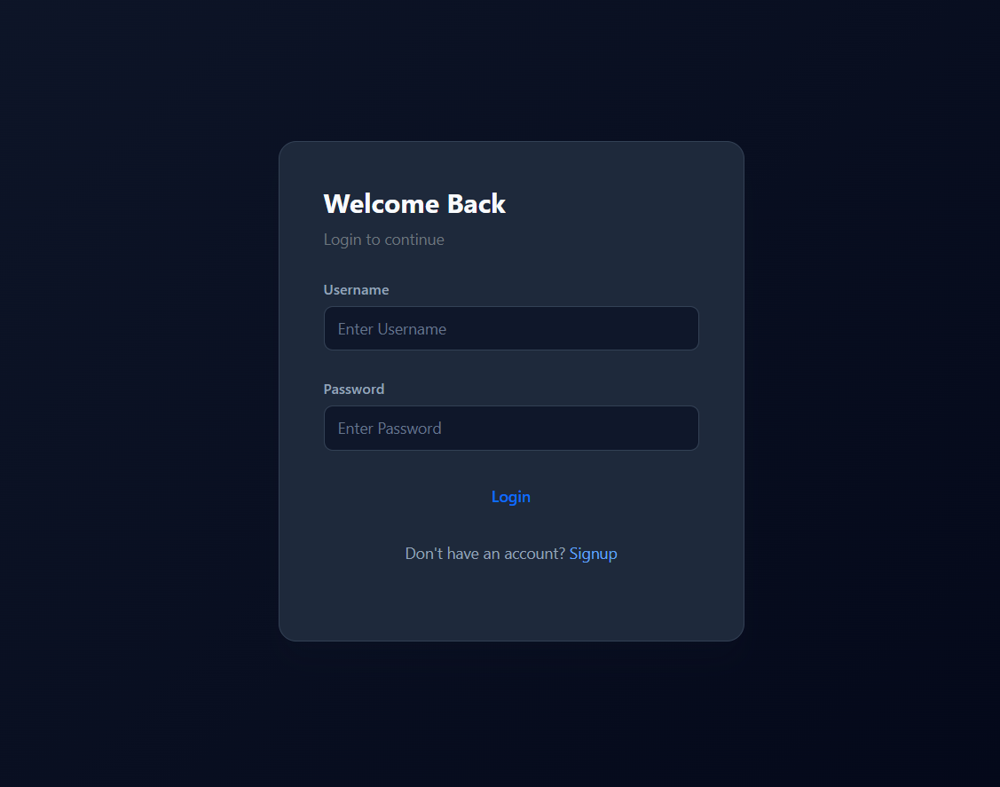
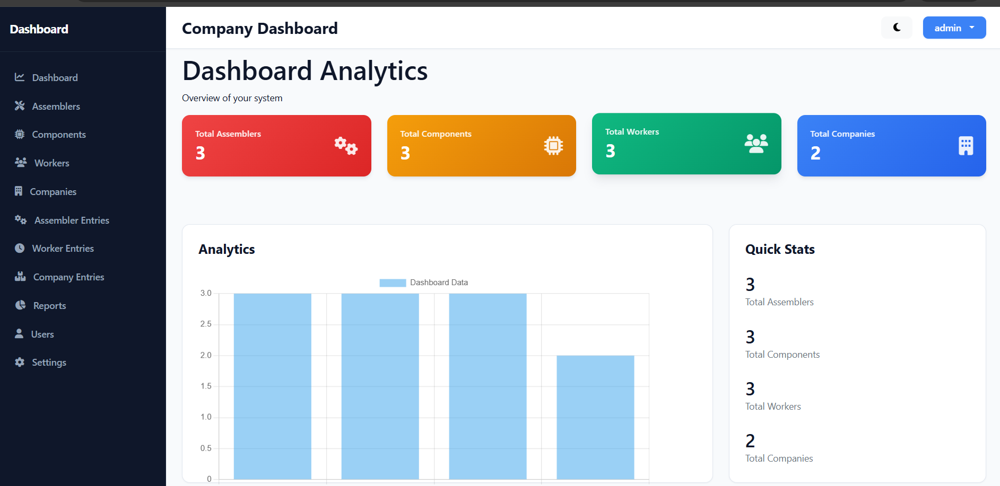
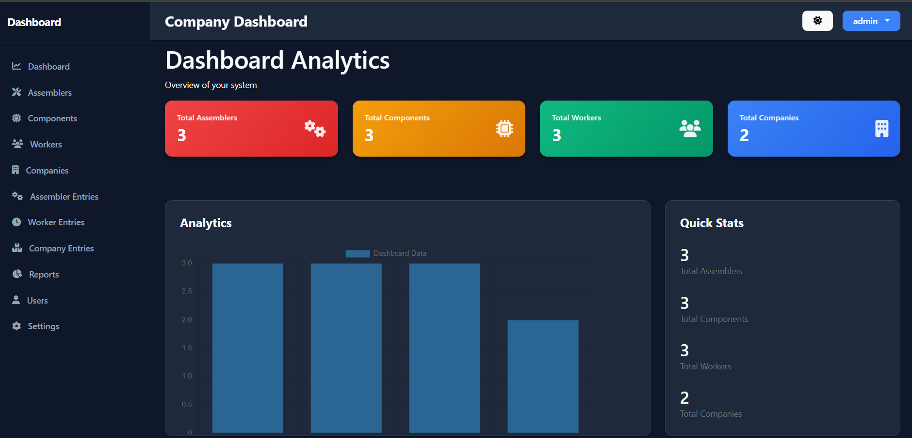
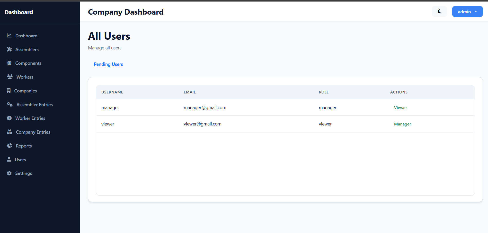
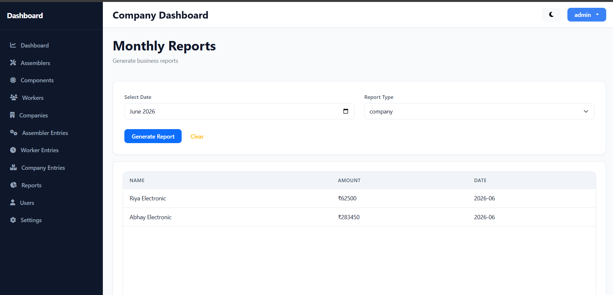
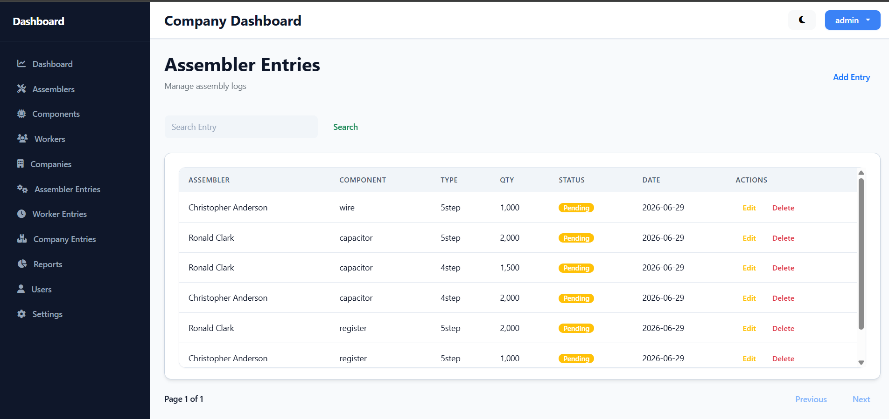
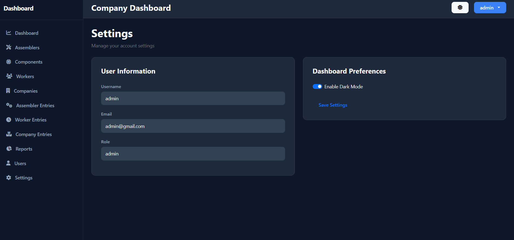
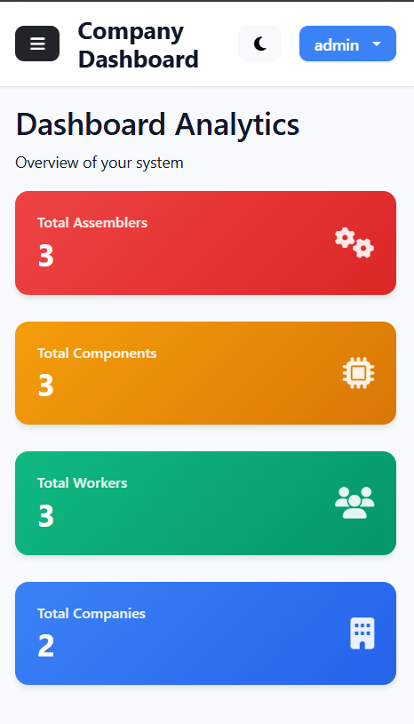
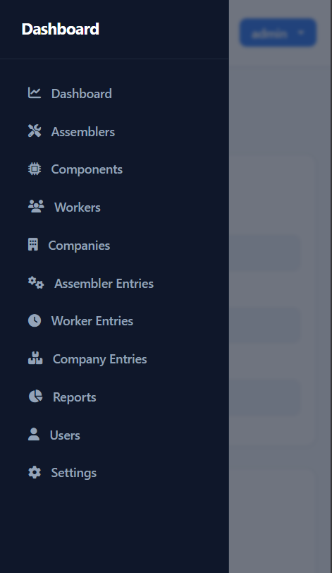

# 🏭 Business Management Dashboard

**A business management dashboard built for manufacturing workflows using Node.js, Express.js, MongoDB and Vanilla JavaScript.**

It replaces spreadsheet-based operations with a centralized system for managing workers, assemblers, companies, components, products and production entries while providing approval-based authentication, role-based authorization, reporting and a responsive interface.

[](https://nodejs.org/) 
[](https://expressjs.com/) 
[](https://www.mongodb.com/) 
[](https://developer.mozilla.org/en-US/docs/Web/JavaScript) 
[](https://www.passportjs.org/)
[](https://developer.mozilla.org/en-US/docs/Learn/CSS/CSS_layout/Responsive_Design) 
[](https://opensource.org/licenses/MIT)

 
---

## 🌐 Live Demo:
🔗 https://company-dashboard-eua6.onrender.com/

**👤 Demo Credentials**

| Role    | Username | Password |
| ------- | -------- | -------- |
| Admin   | admin    | admin123 |
| Manager | manager  | manager1 |
| Viewer  | viewer   | viewer12 |

> These demo accounts are provided for recruiters and interviewers to explore the application.
 
---

# 📖 Why this project?

Many small manufacturing businesses still rely on Excel sheets or paper records to track production. As the business grows, data becomes difficult to manage, reports take time to generate and controlling user permissions becomes challenging.

This project was built to solve those problems by providing a single dashboard where different roles can securely manage daily production data and generate reports.

---

# 🚩 Problems Solved

- Eliminates manual spreadsheet-based record keeping.
- Centralizes workers, assemblers, companies and products.
- Prevents unauthorized access using Role-Based Access Control.
- Supports approval workflow before users can access the system.
- Generates monthly reports instead of manual calculations.
- Improves data organization with search and pagination.
- Works on desktop and mobile devices.
- Provides dark/light theme for better usability.

---

# ✨ Key Highlights

- Role-Based Access Control (Admin, Manager, Viewer)
- User approval workflow
- Passport Local Authentication
- MongoDB session storage
- Responsive dashboard
- Monthly reporting
- Search & Pagination
- Modular architecture
- Dark / Light Mode

---

# 🖼️ Screenshots

## 🔐 Login



---

## 📊 Dashboard



---

## 🌙 Dark Mode



---

## 👥 Users



---

## 📈 Reports



---

## 🏭 Assembler Entries



---

## ⚙️ Settings



---

## 📱 Mobile Dashboard



---

## ☰ Mobile Sidebar



 

---

# 🏗️ Architecture

```text
Browser
      │
      ▼
Express Server
 ├── Static Frontend
 ├── REST APIs
 ├── Passport Authentication
 └── Business Logic
          │
          ▼
MongoDB Atlas
```

---

# 🛠️ Tech Stack

| Layer          | Technology                      |
| -------------- | ------------------------------- |
| Frontend       | HTML, CSS, Vanilla JavaScript   |
| Backend        | Node.js, Express.js             |
| Database       | MongoDB, Mongoose               |
| Authentication | Passport Local, Express Session |
| Charts         | Chart.js                        |
| Deployment     | Render                          |

---

# 📂 Features

### Authentication

- Login
- Registration
- User approval
- Protected routes
- Session-based authentication

### User Management

- Admin, Manager and Viewer roles
- Approve / Reject users
- Role assignment

### Business Modules

- Workers
- Assemblers
- Companies
- Components
- Products
- Production Entries

### Reports

- Monthly reports
- Search
- Pagination

### UI

- Responsive design
- Dark / Light mode
- Toast notifications

---

# 🚀 Installation

```bash
git clone https://github.com/Taukir713/company-dashboard.git
cd company-dashboard
npm install
```

Create `.env`

```env
PORT=5000
MONGODB_URI=YOUR_ATLAS_URI
SECRET=YOUR_SECRET
SEED_ADMIN_USERNAME=admin
SEED_ADMIN_EMAIL=admin@example.com
SEED_ADMIN_PASSWORD=your_password
```

Create admin:

```bash
npm run seed
```

Run:

```bash
npm start
```
---

# 🔒 Security

- Passport Local Authentication
- Express Session
- Server-side validation
- Role-based authorization
- Protected routes

---

# 🗺️ Roadmap

- PDF Export
- Excel Export
- Notifications
- Audit Logs
- Analytics improvements

---

# 👨‍💻 Author

**Taukir Rafique Shaikh**

- GitHub: https://github.com/Taukir713
- Gmail : shaikhtaukir713@gmail.com 

---

# 📄 License

Licensed under the MIT License.


